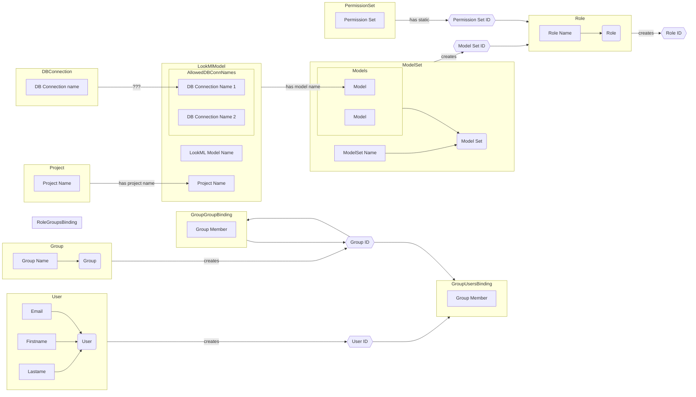
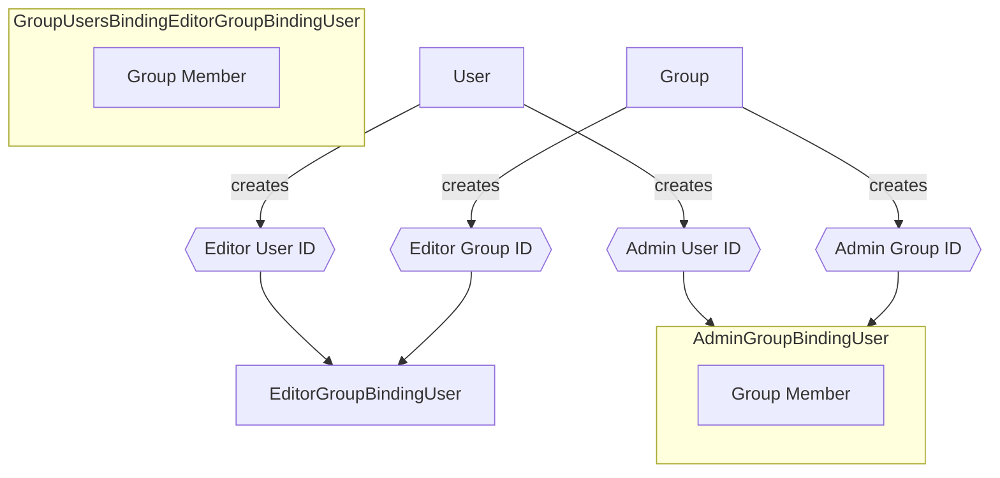
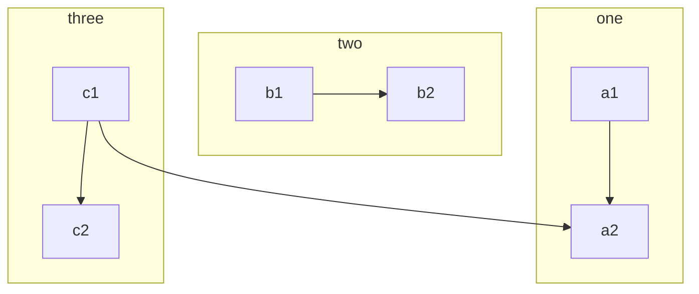
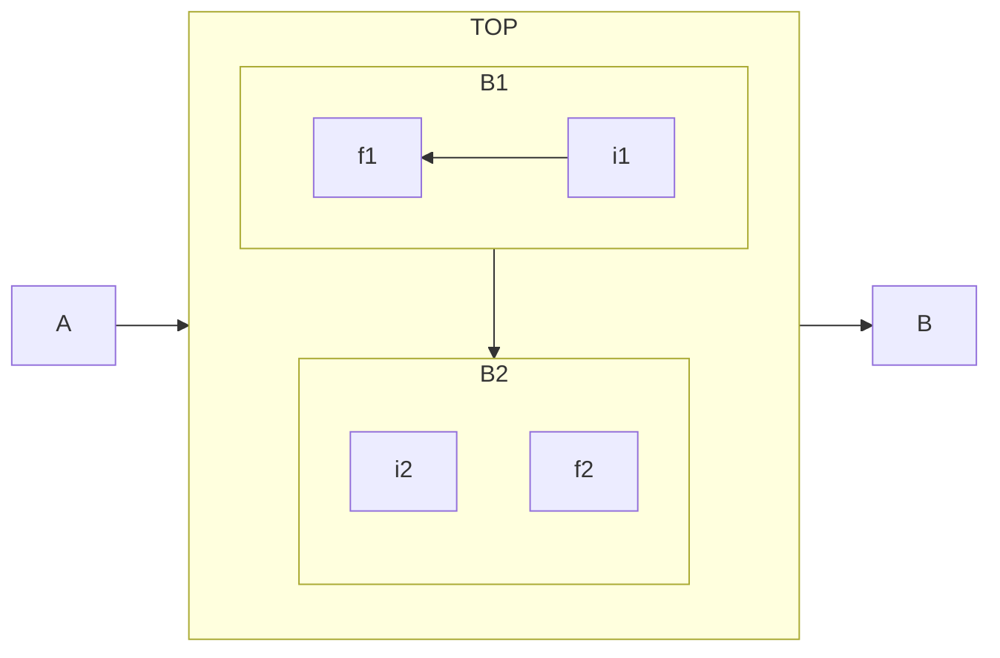
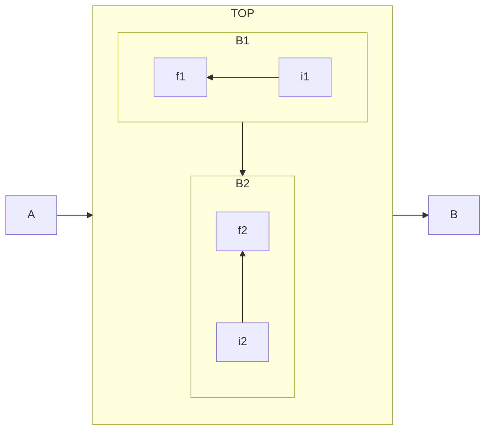

# Notes

## Workflows






ddd
xxx

```mermaid
  subgraph GroupBindingRole
    direction LR
    groupmemberrole[Role Member]
  end
  roleid --> GroupBindingRole
  groupid --> GroupBindingRole
  permset(Permission Set) --->|has| permsetid{{Permission Set ID}}

flowchart TB;
  subgraph User
    direction LR
    email[Email] --> user
    fname[Firstname] --> user
    lname[Lastame] --> user
  end
  User -->x
```








